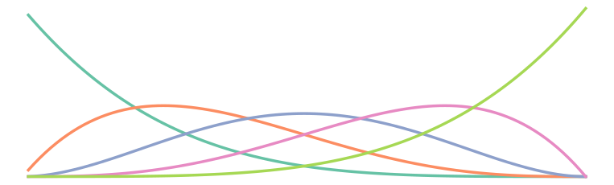

# 𐄷 Weighted ERM - fast & accurate change point regression in R

---

<p align="center">
  
</p>

<p align="center">
  <a href="https://arxiv.org/abs/2604.11746"></a>
  <a href="https://doi.org/10.5281/zenodo.19472923">
    
  </a>
  <br>
  <a href="https://CRAN.R-project.org/package=weightederm">
    
  </a>
  <a href="https://github.com/gabrielarpino/weightederm-r/actions/workflows/R-CMD-check.yaml">
    
  </a>
</p>

> R interface to the [weightederm](https://github.com/gabrielarpino/weightederm)
> Python package — changepoint regression via Weighted Empirical Risk Minimization (WERM).

## Overview

`weightederm` detects changepoints in ordered regression data by minimizing a
Weighted Empirical Risk (WERM). The method is described in:

> [Inferring Change Points in Regression via Sample Weighting](https://arxiv.org/abs/2604.11746) by Gabriel Arpino and Ramji Venkataramanan. 

Six estimators are available:

| Loss           | Fixed `num_chgpts`      | Unknown `num_chgpts` via CV  |
|----------------|-------------------------|------------------------------|
| Least squares  | `werm_least_squares()`  | `werm_least_squares_cv()`    |
| Huber          | `werm_huber()`          | `werm_huber_cv()`            |
| Logistic       | `werm_logistic()`       | `werm_logistic_cv()`         |

## Prerequisites

This package calls Python via [reticulate](https://rstudio.github.io/reticulate/).
You need:

1. **Python ≥ 3.9** — install from <https://www.python.org/> or via conda/pyenv.
2. **The `weightederm` Python package:**

```bash
pip install git+https://github.com/gabrielarpino/weightederm.git
```

## Installation

### From CRAN

```r
install.packages("weightederm")
```

### Development version from GitHub

```r
# install.packages("pak")
pak::pak("gabrielarpino/weightederm-r")
```

Or with `remotes`:

```r
# install.packages("remotes")
remotes::install_github("gabrielarpino/weightederm-r")
```

## Pointing to your Python environment

By default, `reticulate` auto-discovers Python. If it picks the wrong one, call
`weightederm_configure_python()` **before** your first model fit:

```r
# Option 1 — point to a specific Python binary
weightederm_configure_python(python = "/path/to/your/venv/bin/python")

# Option 2 — point to the Python binary inside a conda environment
weightederm_configure_python("/path/to/miniconda/envs/my_conda_env/bin/python")
```

You can also set the `RETICULATE_PYTHON` environment variable in your
`.Renviron` file to avoid calling this every session:

```
RETICULATE_PYTHON=/path/to/your/venv/bin/python
```

## Quick start

### M1 — fixed number of changepoints, sparse linear regression

```r
library(weightederm)
set.seed(0)

n <- 120L; p <- 20L; true_cp <- 60L
X <- matrix(rnorm(n * p), n, p)

beta_left  <- rep(0, p); beta_left[c(1, 4)]  <- c( 2.0, -1.5)
beta_right <- rep(0, p); beta_right[c(1, 4)] <- c(-1.0,  2.5)

y <- numeric(n)
y[1:true_cp]          <- X[1:true_cp, ]          %*% beta_left  + rnorm(true_cp, sd = 0.2)
y[(true_cp+1):n]      <- X[(true_cp+1):n, ]      %*% beta_right + rnorm(n - true_cp, sd = 0.2)

fit <- werm_least_squares(X, y, num_chgpts = 1L, delta = 5L,
                          search_method = "efficient", fit_intercept = FALSE)
fit
#> WERM Changepoint Estimator (werm_least_squares)
#>   Changepoints (1-indexed): 60
#>   num_chgpts: 1 | num_signals: 2 | n_features_in: 20
#>   Objective: ...
```

### M2 — unknown number of changepoints via cross-validation

```r
set.seed(1)
n <- 180L; p <- 10L
X <- matrix(rnorm(n * p), n, p)

beta_1 <- rep(0, p); beta_1[1]      <- 3.5
beta_2 <- rep(0, p); beta_2[1:2]    <- c(-3.0, 3.0)
beta_3 <- rep(0, p); beta_3[1:3]    <- c(2.5, -2.5, 2.5)

y <- numeric(n)
y[1:60]    <- X[1:60, ]    %*% beta_1 + rnorm(60, sd = 0.05)
y[61:120]  <- X[61:120, ]  %*% beta_2 + rnorm(60, sd = 0.05)
y[121:180] <- X[121:180, ] %*% beta_3 + rnorm(60, sd = 0.05)

fit <- werm_least_squares_cv(X, y, max_num_chgpts = 2L, delta = 5L, cv = 3L,
                              search_method = "efficient", fit_intercept = FALSE)
fit$best_num_chgpts  # 2
fit$changepoints     # near c(60, 120)
fit$cv_results       # data.frame of num_chgpts vs mean_test_score
```

### M3 — binary classification with a structural break

```r
set.seed(2)
n <- 160L; p <- 12L; true_cp <- 80L
X <- matrix(rnorm(n * p), n, p)

beta_left  <- rep(0, p); beta_left[c(1, 3)]  <- c( 2.5, -2.0)
beta_right <- rep(0, p); beta_right[c(1, 3)] <- c(-2.5,  2.0)

eta <- numeric(n)
eta[1:true_cp]       <- X[1:true_cp, ]       %*% beta_left
eta[(true_cp+1):n]   <- X[(true_cp+1):n, ]   %*% beta_right
y <- rbinom(n, 1L, 1 / (1 + exp(-eta)))

fit <- werm_logistic(X, y, num_chgpts = 1L, delta = 5L,
                     search_method = "efficient", fit_intercept = FALSE,
                     max_iter = 300L)
fit$changepoints   # near 80
fit$classes        # c("0", "1")

# Predict probabilities on new data
X_new <- matrix(rnorm(10 * p), 10, p)
predict(fit, X_new, type = "prob")   # 10 × 2 matrix
predict(fit, X_new, type = "class")  # character vector of labels
```

## Key arguments

| Argument           | Description                                                          | Default   |
|--------------------|----------------------------------------------------------------------|-----------|
| `num_chgpts`       | Number of changepoints (fixed estimators)                           | required  |
| `max_num_chgpts`   | Upper bound for CV search (CV estimators)                           | required  |
| `delta`            | Minimum gap between changepoints during search                      | `1L`      |
| `search_method`    | `"efficient"` (greedy + local refinement) or `"brute_force"`        | `"efficient"` |
| `fit_intercept`    | Include per-segment intercept                                        | `TRUE`    |
| `cv`               | Number of interleaved CV folds (CV estimators)                       | `5L`      |
| `penalty`          | `"none"`, `"l1"`, or `"l2"`                                         | `"none"` (`"l2"` for logistic) |
| `alpha`            | Penalty strength                                                     | `0.0`     |
| `epsilon`          | Huber transition parameter                                           | `1.35`    |
| `max_iter`         | Optimizer iterations (Huber / logistic)                             | `100L`    |

## Fitted object

Every `werm_*()` call returns a named list with class `c("werm_<type>", "werm_fit")`:

| Element                 | Description                                                |
|-------------------------|------------------------------------------------------------|
| `changepoints`          | Integer vector, **1-indexed** (R convention)               |
| `num_chgpts`            | Number of detected changepoints                            |
| `num_signals`           | `num_chgpts + 1`                                           |
| `objective`             | Minimised WERM value                                       |
| `signal_coefs`          | `(num_signals × p)` Stage-1 WERM coefficient matrix       |
| `signal_intercepts`     | Numeric vector or `NULL`                                   |
| `last_segment_coef`     | Coefficients used by `predict()`                           |
| `last_segment_intercept`| Numeric or `NULL`                                          |
| `n_features_in`         | Number of input features                                   |
| `classes`               | (logistic only) Character vector of length 2               |

CV estimators additionally expose `best_num_chgpts`, `best_score`, `cv_results`
(a data frame), `num_chgpts_grid`, `segment_bounds`, `segment_coefs`, and
`segment_intercepts`.

## S3 methods

```r
print(fit)           # compact summary
summary(fit)         # print + coefficient table
coef(fit)            # last_segment_coef vector
predict(fit, X_new)  # numeric predictions (regression) or class labels / probabilities (logistic)
```

## Related resources

- [User Guide](https://github.com/gabrielarpino/weightederm-r/blob/main/docs/user_guide.md) — algorithm overview, fixed vs CV, penalties, prediction, S3 methods (with tested R examples)
- [weightederm Python package](https://github.com/gabrielarpino/weightederm) — Python API, parameter reference, benchmark notebook

## License

Apache License 2.0 — the same license as the underlying Python package.
